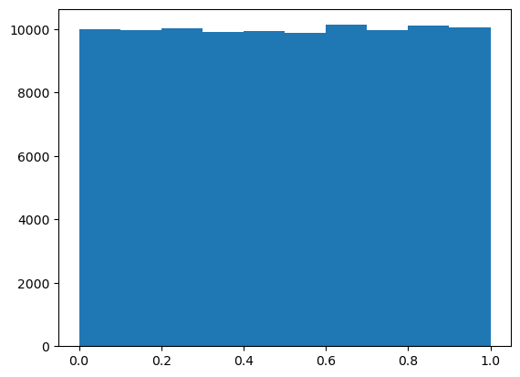
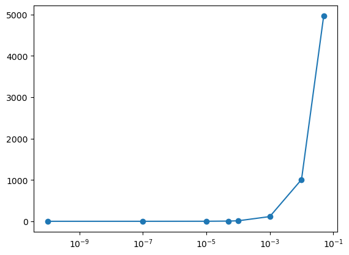

```python
import matplotlib.pyplot as plt
import numpy as np
from scipy.stats import ttest_1samp
%matplotlib inline
```

# Распределение p-value при нулевом эффекте 

Спасибо Руслану, отличные статьи и двойка мне. Но, как мне кажется вопрос который задает Сергей Георгиевич, и на который отвечала я -  он другой. В рамках одного эксперимента (а все попарные сравнения - все один эксперимент), могу ли я ранжировать значимость на основе p-value? То есть, в случае нулевого эффекта, могу ли я сказать, что шанс совершить ошибку (отвергнуть нулевую гипотезу) при меньшем значении p-value он меньше? И точечные значения p-value или даже интервальные нас не интересуют. А интересует количество всех ошибок при верной нулевой гипотезе, при таком же или меньшем p_value. При этом нас вообще не интересуют p-value большие 0.1, а шкалу p-value мы тоже смотрим не линейно, мы интуитивно мало дифференицруем 0.01 и 0.005, скорее 0.01 и 0.0000000001, поэтому посмотрим что будет получаться при шкале  - где шаг степень 10.
[10-9, 10-8 и т.д]


```python
p_vals = np.array([ttest_1samp(np.random.randn(1000), 0).pvalue for i in range(100000)]);
```


```python
# действительно равномерное распределение p-значений
plt.hist(p_vals);
```


    

    


```python
# а вот тут мы отвечаем на интересующий нас вопрос
thres = [1e-10, 1e-7,1e-5, 5*1e-5, 1e-4, 1e-3, 1e-2, 5*1e-2]
fneg = [np.sum([p_vals<thr]) for thr in thres]
fig,ax = plt.subplots()
ax.plot(thres, fneg, marker = 'o')
ax.set_xscale('log')
```


    

    


```python

```
